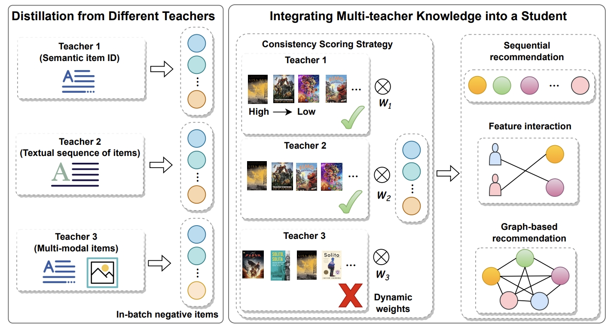

## Overview

We propose **PRM-KD**, which stands for joint **K**nowledge **D**istillation from different **P**re-trained **R**ecommendation **M**odels. Aiming to selectively integrate the additional information distilled from different pre-trained recommendation models (PRMs) into various types of student models in new domains.

## Note
Due to the policy in the industrial incorporation where the code belongs to, we will release the code after the reviewing period.
